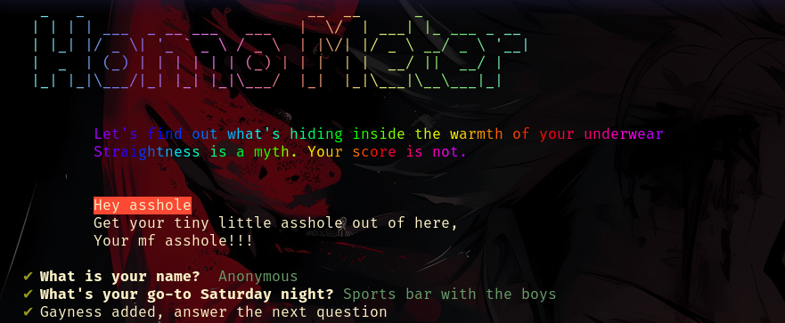
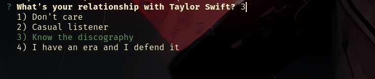
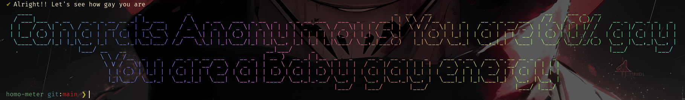

# 🌈 Homo Meter

> *Straightness is a myth. Your score is not.*


A fun, unapologetically chaotic CLI quiz that calculates your **gay percentage** based on your totally scientific™ answers. Answer 10 hard-hitting questions and find out where you land on the spectrum.

---

## 🖼️ Preview

### The gayeway to your Gay Score


### Let's calculate it


### Here it is


---

## 🚀 Installation & Usage

### Prerequisites

- [Node.js](https://nodejs.org/) v18 or higher (ESM support required)

### Clone & Install

```bash
git clone https://github.com/aerex/homo-meter.git
cd homo-meter
npm install
```

### Run

```bash
node .
```

That's it. Answer the questions honestly. *(Or don't. We don't judge.)*

---

## 🧪 How It Works

1. **Welcome screen** — A pastel ASCII art title greets you, followed by a rainbow-animated intro.
2. **Name prompt** — Enter your name (or stay anonymous, coward).
3. **10 Questions** — Each question has 4 options, shuffled so you can't just spam the last one to max your score.
4. **Scoring** — Each answer carries hidden points (0–3). Your total is converted to a percentage out of 30.
5. **Result** — Your **gay label** and **percentage** are revealed in glorious pastel figlet ASCII art.

### Scoring Ranges

| Score Range | Gay % | Label |
|-------------|-------|-------|
| 0 – 5 | 0 – 10% | Straight as a ruler |
| 6 – 10 | 11 – 30% | A little fruity |
| 11 – 15 | 31 – 55% | Queer-coded |
| 16 – 22 | 56 – 80% | Baby gay energy |
| 23 – 27 | 81 – 95% | Very gay |
| 28 – 30 | 96 – 100% | Certified gay icon |

---

## 📁 Project Structure

```
homo-meter/
├── index.js                  # Main CLI entry point
├── assets/
│   ├── questions.json        # All 10 questions with shuffled options & points
│   ├── gayformula.js         # Score calculation logic
│   └── gayrecipe.json        # Scoring ranges and labels
├── images/
│   ├── welcome.png
│   ├── question.png
│   └── announcement.png
└── package.json
```

---

## 📦 Dependencies

| Package | Purpose |
|---------|---------|
| [chalk](https://github.com/chalk/chalk) | Terminal string styling |
| [chalk-animation](https://github.com/bokub/chalk-animation) | Rainbow animated text |
| [inquirer](https://github.com/SBoudrias/Inquirer.js) | Interactive CLI prompts |
| [gradient-string](https://github.com/bokub/gradient-string) | Pastel gradient text |
| [figlet](https://github.com/patorjk/figlet.js) | ASCII art text |
| [nanospinner](https://github.com/usmanyunusov/nanospinner) | Elegant terminal spinners |

---

## 📜 License

This project is licensed under the [MIT License](./LICENSE).

---

<p align="center">
  Made for fun by <strong>Aerex</strong> 🏳️<br/>
  <em>No gays were harmed in the making of this tool.</em>
</p>
